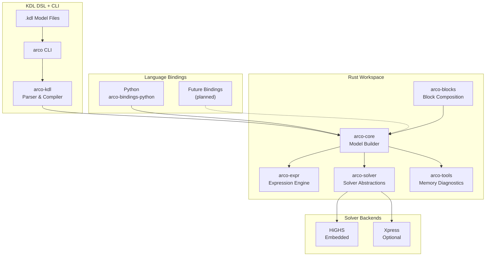

<div align="center">

# Arco

**A memory-smart optimization DSL and solver for LP and MIP problems on
constrained hardware.**

[](https://github.com/NatLabRockies/arco/actions/workflows/ci.yaml)
[](https://www.rust-lang.org/)
[](https://pypi.org/project/arco/)
[](./LICENSE.md)
[](./docs/)
[](https://pypi.org/project/arco/)

</div>

> [!WARNING]
> Arco is built primarily for internal use within our organization.
> You are welcome to try it, but we make no guarantees about API stability or
> robustness at this stage. For battle-tested alternatives, consider
> [Pyomo](https://www.pyomo.org/) (Python) or [JuMP](https://jump.dev/) (Julia).

Arco (**Assembled Resource-Constrained Optimization**) is an optimization
framework built around a KDL-based domain-specific language and a CLI
compiler/solver. You write optimization models in `.kdl` files, and the `arco`
CLI compiles, validates, inspects, and solves them. Language bindings (Python
today, more planned) provide programmatic access to the same engine.

Built for harder optimization problems on constrained resources, Arco is
intentional about every allocation, careful with stack and heap behavior, and
relentless about minimizing memory usage so more systems can run real workloads.

> [!NOTE]
> NLR Software Record: **SWR-26-030**

<p align="center">
  <a href="#quickstart">Quickstart</a> ·
  <a href="#installation">Installation</a> ·
  <a href="#kdl-language">KDL Language</a> ·
  <a href="#cli-reference">CLI Reference</a> ·
  <a href="#language-bindings">Language Bindings</a> ·
  <a href="#features">Features</a> ·
  <a href="#architecture">Architecture</a> ·
  <a href="#benchmarking">Benchmarking</a> ·
  <a href="#contributing">Contributing</a> ·
  <a href="#license">License</a> ·
  <a href="#disclaimer">Disclaimer</a>
</p>

## Quickstart

Install the CLI:

```bash
curl --proto '=https' --tlsv1.2 -LsSf https://github.com/NatLabRockies/arco/releases/latest/download/arco-installer.sh | sh
```

Write an optimization model using the low-level KDL profile:

```kdl
// input.kdl
data units from="data/units.csv" {
  map asset_id from="asset"
  map variable_cost from="cost"

  set asset_id alias="a"
  param variable_cost index_by="asset_id"
}

model GeneratorAllocation {
  set asset_id alias="a"
  set time alias="t" from="horizon"

  param variable_cost index_by="asset_id"

  control dispatch {
    index asset_id
    index time
  }

  constraint capacity_limit {
    dispatch[a,t] <= 10
  }

  minimize TotalCost {
    sum(variable_cost[a] * dispatch[a,t] for a in asset_id for t in time)
  }
}

scenario GeneratorAllocationDay {
  horizon steps=3 resolution=PT1H
  use GeneratorAllocation
}
```

Supply `data/units.csv`:

```csv
asset,cost
GenA,10
GenB,12
```

Solve it:

```bash
arco run input.kdl --compact
```

```json
{
  "solve_status": "optimal",
  "active_scenario": "GeneratorAllocationDay",
  "objective": {
    "name": "TotalCost",
    "sense": "minimize",
    "value": 0.0
  },
  "reports": [],
  "counts": { "parameters": 1, "variables": 1, "constraints": 1 },
  "timing": { "total_ms": 8.48 }
}
```

> [!NOTE]
> Arco embeds the HiGHS solver. No external solver installation or
> configuration required.

## Installation

### CLI

macOS and Linux:

```bash
curl --proto '=https' --tlsv1.2 -LsSf https://github.com/NatLabRockies/arco/releases/latest/download/arco-installer.sh | sh
```

Windows (PowerShell):

```powershell
powershell -ExecutionPolicy ByPass -c "irm https://github.com/NatLabRockies/arco/releases/latest/download/arco-installer.ps1 | iex"
```

The installer places the `arco` binary in `~/.cargo/bin` and includes a
self-updater (`arco-update`).

### Python Binding

Python 3.9 or newer. Using `uv` (recommended) or `pip`:

```bash
uv add arco
```

```bash
pip install arco
```

### From Source

For development or to build everything locally:

```bash
git clone https://github.com/NatLabRockies/arco.git
cd arco

# Install just (command runner)
cargo install just

# Build CLI
just build

# Build and install Python extension in development mode
just py-dev

# Run tests
just test
uv run pytest
```

## KDL Language

Arco models are written in [KDL](https://kdl.dev) files.

The supported profile is low-level and explicit:

- top-level `data`, `subset`, `model`, and `scenario`
- data-level `map`, `set`, `index`, and `param`
- model-level `set`, `param`, `control`, `expression`, `constraint`, and one objective
- scenario-level `horizon`, `use`, optional `data` bindings, and `report`

Example:

```kdl
data units from="data/units.csv" {
  map asset_id from="asset"
  map variable_cost from="cost"

  set asset_id alias="a"
  param variable_cost index_by="asset_id"
}

model GeneratorAllocation {
  set asset_id alias="a"
  set time alias="t" from="horizon"

  param variable_cost index_by="asset_id"

  control dispatch {
    index asset_id
    index time
  }

  minimize TotalCost {
    sum(variable_cost[a] * dispatch[a,t] for a in asset_id for t in time)
  }
}

scenario AllocationDay {
  horizon steps=24 resolution=PT1H
  use GeneratorAllocation
}
```

> [!TIP]
> See the [KDL syntax reference](./docs/reference/kdl-syntax-summary.md)
> for the full grammar, algebra operators, constraint forms, and reduction
> syntax. Complete working examples live in the [`examples/`](./examples/)
> directory.

## CLI Reference

The `arco` CLI compiles and solves KDL optimization models.

```
arco <command> [options]
```

| Command                   | Description                                          |
| :------------------------ | :--------------------------------------------------- |
| `arco run <file>`         | Compile and solve a `.kdl` formulation               |
| `arco validate <file>`    | Validate a `.kdl` file without solving               |
| `arco inspect <file>`     | Inspect semantic model (sets, variables, parameters) |
| `arco print-model <file>` | Print the algebraic model sent to the solver         |
| `arco export <file>`      | Export as LP or MPS format                           |
| `arco debug <file>`       | Open an interactive IPython debug shell              |
| `arco solver show`        | Show the active solver backend                       |
| `arco solver set <name>`  | Set the solver backend (`highs` or `xpress`)         |

### Examples

Validate without solving:

```bash
$ arco validate input.kdl
Validated file://input.kdl in 4ms (arco 0.2.8)
```

Inspect the semantic model:

```bash
$ arco inspect input.kdl --section constraints
[constraint]
  name     : soc_balance
  template : soc[a,t] = soc[a,t-1] + charge_efficiency[a] * charge[a,t] - ...
  relation : equal
  ...

[constraint]
  name     : charge_limit
  template : charge[a,t] <= power_mw[a]
  relation : less_or_equal
  ...
```

Export to LP format for external solvers:

```bash
arco export input.kdl --format lp --output model.lp
```

Use `-v` for info-level tracing, `-vv` for debug-level. Pass `--compact` to
`arco run` to omit full variable value arrays from the JSON output. Use
`--filter-variable` or `--filter-asset` to narrow results.

## Language Bindings

Arco provides language bindings for programmatic access to the optimization
engine. Python is the first available binding, with more languages planned.

### Python

Install with `uv` (recommended) or `pip`:

```bash
uv add arco
```

Build and solve a production planning problem:

```python
import arco

model = arco.Model()

x = model.add_variable(
    bounds=arco.Bounds(lower=1.0, upper=float("inf")),
    name="product_x"
)
y = model.add_variable(
    bounds=arco.Bounds(lower=2.0, upper=float("inf")),
    name="product_y"
)

model.add_constraint(x + y >= 5.0, name="demand")
model.minimize(3.0 * x + 2.0 * y)

solution = model.solve()
assert solution.is_optimal()

print(f"Optimal: x={solution.value(x):.1f}, y={solution.value(y):.1f}")
print(f"Cost: {solution.objective_value:.1f}")
```

<details>
<summary><strong>Indexed Variables</strong></summary>

Work with structured, array-like variables for large-scale problems:

```python
import arco

model = arco.Model()

plants = model.add_index_set(["NYC", "LA", "CHI"])
products = model.add_index_set(range(5))

production = model.add_variables(
    index_sets=[plants, products],
    bounds=arco.Bounds(lower=0, upper=100),
    name="production"
)

total_by_plant = production.sum(axis=1)
model.add_constraint(total_by_plant >= 10)

solution = model.solve()
```

</details>

<details>
<summary><strong>Block Composition</strong></summary>

Compose multi-stage optimization workflows using blocks:

```python
from dataclasses import dataclass
import arco
from arco import block

@dataclass
class FacilityInput:
    capacity: float
    demand: float

@block
def facility_block(model, data: FacilityInput):
    x = model.add_variable(lb=0, ub=data.capacity, name="output")
    model.add_constraint(x >= data.demand)
    model.minimize(x)
    return {"output": x}

model = arco.Model()
block_handle = model.add_block(
    facility_block, FacilityInput(capacity=100, demand=50)
)
solution = model.solve()
```

</details>

> [!TIP]
> See the [tutorials](./docs/tutorials/) and
> [how-to guides](./docs/how-to/) for comprehensive Python examples.

## Features

| Feature                   | Status | Description                                                          |
| :------------------------ | :----: | :------------------------------------------------------------------- |
| **KDL Optimization DSL**  |   ✅   | Low-level KDL profile with explicit data/model/scenario declarations |
| **CLI Compiler/Solver**   |   ✅   | Compile, validate, inspect, solve, and export from the command line  |
| **LP / MIP Solving**      |   ✅   | Linear and mixed-integer programming via embedded HiGHS              |
| **HiGHS Backend**         |   ✅   | Open-source solver embedded out of the box                           |
| **Xpress Backend**        |   ✅   | Commercial solver support for enterprise users                       |
| **Model Inspection**      |   ✅   | Semantic introspection of sets, variables, constraints, parameters   |
| **LP / MPS Export**       |   ✅   | Export algebraic models for external solvers                         |
| **CSV Data Binding**      |   ✅   | Wire model parameters to CSV data sources in scenarios               |
| **Block Orchestration**   |   ✅   | DAG-based composition for multi-stage problems                       |
| **Memory Diagnostics**    |   ✅   | Built-in tracking of memory usage and bottlenecks                    |
| **Warm Starting**         |   ✅   | Reuse solutions across sequential solves                             |
| **Python Binding**        |   ✅   | Programmatic model building with NumPy integration                   |
| **Editor Support**        |   ✅   | Tree-sitter grammar overlay for KDL + algebra syntax highlighting    |
| **Parallel Block Solve**  |   🚧   | Under testing for concurrent block execution                         |
| **Additional Bindings**   |   📋   | Planned language bindings beyond Python                              |
| **Distributed Execution** |   📋   | Planned for distributed optimization workflows                       |

**Legend:** ✅ Available | 🚧 Under Testing | 📋 Planned

## Architecture

Arco is organized as a Rust workspace. The KDL DSL and CLI are the primary
interface. Language bindings provide programmatic access to the same core.



### Crate Overview

| Crate         | Purpose                                                 |
| :------------ | :------------------------------------------------------ |
| `arco-cli`    | CLI compiler and solver for KDL optimization models     |
| `arco-kdl`    | KDL parser, semantic validation, and algebraic lowering |
| `arco-core`   | Model construction, variables, constraints, objectives  |
| `arco-expr`   | Expression trees and constraint generation              |
| `arco-solver` | Solver-agnostic abstractions and solution handling      |
| `arco-highs`  | HiGHS solver integration (embedded)                     |
| `arco-blocks` | DAG-based block composition and orchestration           |
| `arco-tools`  | Memory instrumentation and diagnostics                  |
| `arco-bench`  | Benchmarking framework for regression testing           |

## Benchmarking

Use `arco-bench` to run performance benchmarks and catch regressions:

```bash
# Run default benchmark scenarios
just bench-run

# Run with custom parameters
just bench-run --scenario model-build,fac25 --cases 1000,10000 --repetitions 3

# Generate report
just bench-report artifacts/bench/results.jsonl

# Compare and gate on regressions
just bench-gate baseline.jsonl candidate.jsonl 5 5
```

## Contributing

Contributions are welcome. Please see [`CONTRIBUTING.md`](./CONTRIBUTING.md) for
the development workflow, testing expectations, and documentation requirements.

Quick start for contributors:

```bash
# Setup
just fmt      # Format code
just clippy   # Run linter
just check    # Type-check workspace

# Testing
just test     # Run Rust tests
just py-test  # Run Python doctests

# Full CI gate
just ci
```

Release and versioning behavior is defined in
[`RELEASE_POLICY.md`](./RELEASE_POLICY.md).

## License

Arco is licensed under the BSD 3-Clause License. See
[`LICENSE.md`](./LICENSE.md) for details.

The embedded HiGHS solver is licensed under the MIT License. See
[`licenses/HiGHS-MIT.txt`](./licenses/HiGHS-MIT.txt) for details.

## Disclaimer

This repository includes an AI-generation disclaimer in
[`DISCLAIMER.md`](./DISCLAIMER.md).

---

<div align="center">

**[Documentation](./docs/)** ·
**[Examples](./examples/)** ·
**[Issues](https://github.com/NatLabRockies/arco/issues)** ·
**[Releases](https://github.com/NatLabRockies/arco/releases)**

</div>
