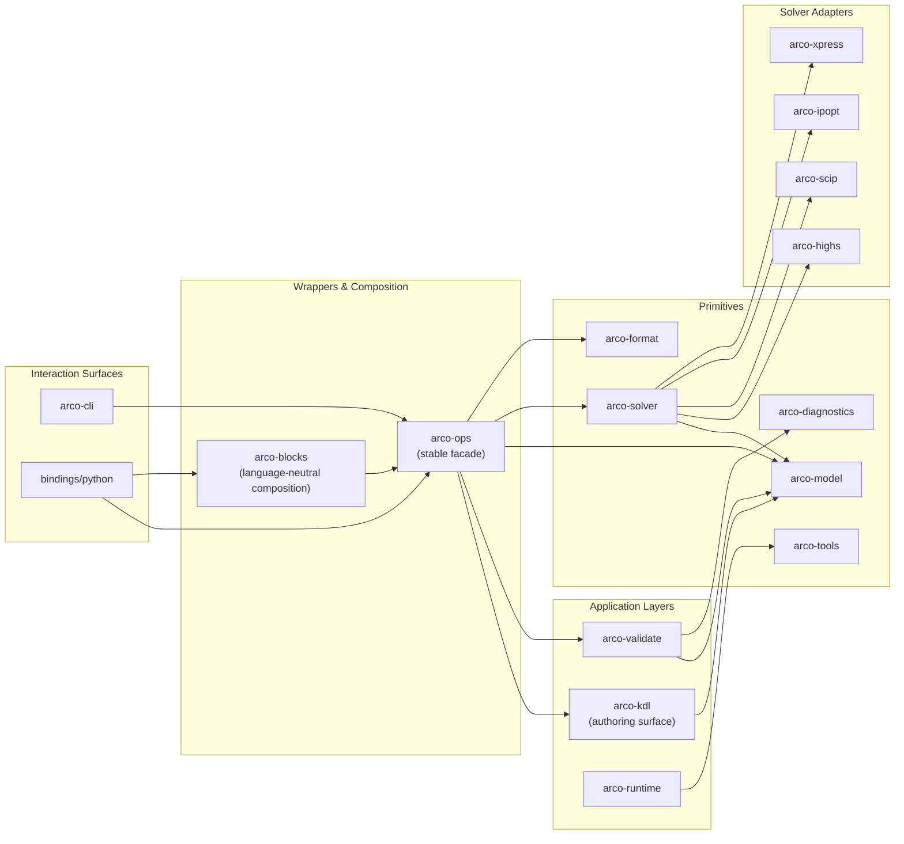

<div align="center">

# Arco

**A memory-smart optimization DSL and solver for LP and MIP problems on
constrained hardware.**

[](https://github.com/NatLabRockies/arco/actions/workflows/ci.yaml)
[](https://www.rust-lang.org/)
[](https://pypi.org/project/arco/)
[](./LICENSE.md)
[](./docs/)
[](https://pypi.org/project/arco/)

</div>

> [!WARNING]
> Arco is built primarily for internal use within our organization.
> You are welcome to try it, but we make no guarantees about API stability or
> robustness at this stage. For battle-tested alternatives, consider
> [Pyomo](https://www.pyomo.org/) (Python) or [JuMP](https://jump.dev/) (Julia).

Arco (**Assembled Resource-Constrained Optimization**) is an optimization
framework built around a KDL-based domain-specific language and a CLI
compiler/solver. You write optimization models in `.kdl` files, and the `arco`
CLI compiles, validates, inspects, and solves them. Language bindings (Python
today, more planned) provide programmatic access to the same engine.

Built for harder optimization problems on constrained resources, Arco is
intentional about every allocation, careful with stack and heap behavior, and
relentless about minimizing memory usage so more systems can run real workloads.

> [!NOTE]
> NLR Software Record: **SWR-26-030**

<p align="center">
  <a href="#quickstart">Quickstart</a> ·
  <a href="#installation">Installation</a> ·
  <a href="#kdl-language">KDL Language</a> ·
  <a href="#cli-reference">CLI Reference</a> ·
  <a href="#language-bindings">Language Bindings</a> ·
  <a href="#features">Features</a> ·
  <a href="#roadmap">Roadmap</a> ·
  <a href="#architecture">Architecture</a> ·
  <a href="#developer-guide">Developer Guide</a> ·
  <a href="#contributing">Contributing</a> ·
  <a href="#license">License</a> ·
  <a href="#disclaimer">Disclaimer</a>
</p>

## Quickstart

Install the CLI:

```bash
curl --proto '=https' --tlsv1.2 -LsSf https://github.com/NatLabRockies/arco/releases/latest/download/arco-cli-installer.sh | sh
```

Build the smallest model first: produce at least five total units, with `x >= 1`
and `y >= 2`, while minimizing `3x + 2y`.

Python:

```python
import arco

model = arco.Model()
x = model.add_variable(bounds=arco.Bounds(lower=1.0, upper=float("inf")), name="x")
y = model.add_variable(bounds=arco.Bounds(lower=2.0, upper=float("inf")), name="y")

model.add_constraint(x + y >= 5.0, name="demand")
model.minimize(3.0 * x + 2.0 * y)

solution = model.solve(log_to_console=False)

assert solution.is_optimal()
assert round(solution.objective_value, 6) == 11.0
assert round(solution.value(x), 6) == 1.0
assert round(solution.value(y), 6) == 4.0
```

KDL:

```kdl
// input.kdl
model first_model {
  control x lower=1
  control y lower=2

  constraint demand {
    expression { x + y >= 5 }
  }

  minimize total_cost { (3 * x) + (2 * y) }
}
```

Solve it:

```bash
arco run input.kdl --compact
```

```json
{
  "backend": "arco-rust-highs",
  "solve_status": "optimal",
  "active_scenario": "first_model",
  "objective": {
    "name": "total_cost",
    "sense": "Minimize",
    "value": 11.0
  },
  "reports": [],
  "counts": { "parameters": 0, "variables": 2, "constraints": 1 },
  "timing": { "peak_memory_bytes": 15564800 }
}
```

> [!NOTE]
> Arco embeds the HiGHS solver. No external solver installation or
> configuration required.

For indexed models, data files, and sparse variable arrays, continue with the
[tutorials](./docs/tutorials/) and [how-to guides](./docs/how-to/).

## Installation

### CLI

macOS and Linux:

```bash
curl --proto '=https' --tlsv1.2 -LsSf https://github.com/NatLabRockies/arco/releases/latest/download/arco-cli-installer.sh | sh
```

Windows (PowerShell):

```powershell
powershell -ExecutionPolicy ByPass -c "irm https://github.com/NatLabRockies/arco/releases/latest/download/arco-cli-installer.ps1 | iex"
```

The installer places the `arco` binary in the first available XDG-style user
binary directory (`$XDG_BIN_HOME`, `$XDG_DATA_HOME/../bin`, then `~/.local/bin`).
Use `arco self update` to update an installed CLI.

> [!NOTE]
> Linux `*-unknown-linux-gnu` artifacts require a recent glibc. If your system
> is older (for example, glibc 2.28), use a release that includes musl assets
> (`*-unknown-linux-musl`) or build from source:
>
> ```bash
> git clone https://github.com/NatLabRockies/arco.git
> cd arco
> cargo install --path crates/arco-cli --locked
> ```

### Python Binding

Python 3.9 or newer. Using `uv` (recommended) or `pip`:

```bash
uv add arco
```

```bash
pip install arco
```

### From Source

For development or to build everything locally:

```bash
git clone https://github.com/NatLabRockies/arco.git
cd arco

# Install just (command runner, version 1.43.0 or newer)
cargo install just --locked --version 1.43.0

# Verify your just version
just --version

# Install hooks first (recommended)
just install-hooks

# Build and install Python extension in development mode
just py-dev

# Run full local CI-equivalent checks
just ci
```

## KDL Language

Arco models are written in [KDL](https://kdl.dev) files.

The supported profile is low-level and explicit:

- top-level `include`, `set`, `data`, `param`, `model`, and `scenario`
- data-level `map`, `set`, `index`, and `param`
- model-level `set`, `param`, `control`, `expression`, `constraint`, and one objective
- scenario-level `use`, optional `data` bindings, and `report`

For a file with exactly one runnable model and no explicit scenario, Arco
infers a scenario with the same name as the model. Add an explicit `scenario`
when the file contains multiple models, scenario-specific data bindings, or
reports.

Large formulations can be split across files with entrypoint-owned includes:

```kdl
include "sets.kdl"
include "data.kdl"

model GeneratorAllocation {
  include "generator-variables.kdl"
  include "generator-constraints.kdl"

  minimize TotalCost {
    sum(variable_cost[a] * dispatch[a,t] for a in asset_id for t in time)
  }
}

scenario GeneratorAllocationDay {
  use GeneratorAllocation
}
```

Top-level includes add shared declarations such as sets and data blocks.
Includes inside `model` blocks add model children such as controls,
expressions, and constraints. Included files cannot define scenarios or nested
includes.

Example:

```kdl
set time {
  "1"
  "2"
  "3"
}
data units source="data/units.csv" {
  map asset_id from="asset"
  set asset_id alias="a"
  param variable_cost from="cost" index="asset_id"
}
model GeneratorAllocation {
  set asset_id alias="a"
  set time alias="t"
  param variable_cost index="asset_id"
  control dispatch lower=0 {
    index asset_id
    index time
  }

  constraint capacity_limit {
    index a { in asset_id }
    index t { in time }
    expression {
      dispatch[a,t] <= 10
    }
  }
  minimize TotalCost {
    sum(variable_cost[a] * dispatch[a,t] for a in asset_id for t in time)
  }
}

scenario GeneratorAllocationDay {
  use GeneratorAllocation
}
```

> [!TIP]
> See the [Arco syntax specification](./docs/arco-spec.md)
> for the full grammar, algebra operators, constraint forms, and reduction
> syntax. Complete working examples live in the [`examples/`](./examples/)
> directory.

## CLI Reference

The `arco` CLI compiles and solves KDL optimization models.

```
arco <command> [options]
```

| Command                     | Description                                               |
| :-------------------------- | :-------------------------------------------------------- |
| `arco run <file>`           | Compile and solve a `.kdl` formulation                    |
| `arco validate <file>`      | Validate a `.kdl` file without solving                    |
| `arco kdl check <file>`     | Validate KDL, with JSON and optional data materialization |
| `arco --version`            | Print the installed Arco CLI version                      |
| `arco self update`          | Update a standalone installer build                       |
| `arco inspect <file>`       | Inspect semantic model (sets, variables, parameters)      |
| `arco print-model <file>`   | Print the algebraic model sent to the solver              |
| `arco export <file>`        | Export as LP or MPS format                                |
| `arco debug <file>`         | Open an interactive IPython debug shell                   |
| `arco solver show`          | Show the active solver backend                            |
| `arco solver set <backend>` | Set the solver backend (`highs`, `scip`, or `xpress`)     |

### Examples

Validate without solving:

```bash
$ arco validate input.kdl
Validated file://input.kdl in 4ms (arco 0.5.0)
```

Emit machine-readable diagnostics for editors:

```bash
$ arco kdl check input.kdl --format json
{"valid":true,"diagnostics":[]}
```

Check CSV-backed data contracts without solving:

```bash
$ arco kdl check input.kdl --format json --materialize-data
{"valid":true,"diagnostics":[]}
```

Install the local VS Code helper extension:

```bash
cd tools/vscode-arco-kdl
npm run install:local
```

Print CLI version:

```bash
$ arco --version
arco 0.5.0
```

Inspect the semantic model:

```bash
$ arco inspect input.kdl
[[constraint]]
  name     = "soc_balance"
  template = "soc[a,t] = soc[a,t-1] + charge_efficiency[a] * charge[a,t] - ..."
  relation = "eq"

[[constraint]]
  name     = "charge_limit"
  template = "charge[a,t] <= power_mw[a]"
  relation = "le"
```

Export to LP format for external solvers:

```bash
arco export input.kdl --format lp --output model.lp
```

Use `-v` for info-level tracing, `-vv` for debug-level. Pass `--compact` to
`arco run` to omit full variable value arrays from the JSON output. Use
`--filter-variable` or `--filter-asset` to narrow results. The `counts`
section reports lowered variable and constraint instances, not only KDL
declaration templates, so it reflects the problem size handed to the solver.

## Language Bindings

Arco provides language bindings for programmatic access to the optimization
engine. Python is the first available binding, with more languages planned.

### Python

Install with `uv` (recommended) or `pip`:

```bash
uv add arco
```

Build and solve a production planning problem:

```python
import arco

model = arco.Model()

x = model.add_variable(
    bounds=arco.Bounds(lower=1.0, upper=float("inf")),
    name="product_x"
)
y = model.add_variable(
    bounds=arco.Bounds(lower=2.0, upper=float("inf")),
    name="product_y"
)

model.add_constraint(x + y >= 5.0, name="demand")
model.minimize(3.0 * x + 2.0 * y)

solution = model.solve()
assert solution.is_optimal()

print(f"Optimal: x={solution.value(x):.1f}, y={solution.value(y):.1f}")
print(f"Cost: {solution.objective_value:.1f}")
```

<details>
<summary><strong>Indexed Variables</strong></summary>

Work with structured, array-like variables for large-scale problems:

```python
import arco

model = arco.Model()

plants = arco.IndexSet(name="plant", members=["NYC", "LA", "CHI"])
products = arco.IndexSet(name="product", members=range(5))

production = model.add_variables(
    axes=(plants, products),
    bounds=arco.Bounds(lower=0.0, upper=100.0),
    name="production"
)

total_by_plant = production.sum(over=products)
model.add_constraints(total_by_plant >= 10.0, name="minimum_output")
model.minimize(production.sum(), name="total_output")

solution = model.solve()
```

</details>

<details>
<summary><strong>Block Composition</strong></summary>

Compose multi-stage optimization workflows using blocks:

```python
from dataclasses import dataclass
import arco
from arco import block

@dataclass(slots=True)
class FacilityInput:
    capacity: float
    demand: float

@dataclass(slots=True)
class FacilityOutput:
    output: float

@block
def facility_block(model: arco.Model, data: FacilityInput, ctx) -> None:
    x = model.add_variable(
        bounds=arco.Bounds(lower=0.0, upper=data.capacity),
        name="output",
    )
    ctx["output"] = x
    model.add_constraint(x >= data.demand)
    model.minimize(x)

def extract_facility(result, data: FacilityInput, ctx) -> FacilityOutput:
    return FacilityOutput(output=result.value(ctx["output"]))

model = arco.Model()
block_handle = model.add_block(
    facility_block,
    data=FacilityInput(capacity=100.0, demand=50.0),
    extract=extract_facility,
)
solution = model.solve()
```

</details>

> [!TIP]
> See the [tutorials](./docs/tutorials/) and
> [how-to guides](./docs/how-to/) for comprehensive Python examples.

## Features

Language & CLI

- KDL-based optimization DSL — write models in .kdl files with data/model/scenario separation
- CLI compiler — arco run, validate, inspect, print-model, export
- Model inspection — semantic introspection of sets, variables, constraints
- CSV data binding — wire parameters to CSV sources in scenarios

Solvers

- HiGHS (embedded) — open-source LP/MIP solver out of the box
- [SCIP](https://www.scipopt.org/) (embedded via [russcip](https://github.com/scipopt/russcip)) — native LP/MIP solver
- Xpress (optional) — commercial solver support
- LP / MPS export — debug models in external tools
- Stable solver option diagnostics — unsupported warm starts fail with typed errors instead of being ignored

Performance & Tooling

- Memory diagnostics — built-in tracking of allocations
- Block orchestration — DAG-based composition for multi-stage problems
- Python bindings — programmatic access with NumPy integration
- Editor support — tree-sitter grammar for syntax highlighting

## Roadmap

Curious about what we're working on? Check out the roadmap:

- [Active issues](https://github.com/NatLabRockies/arco/issues?q=is%3Aopen+is%3Aissue+label%3A%22working+on+it%22+sort%3Aupdated-asc) - Issues that we are actively working on
- [Prioritized backlog](https://github.com/NatLabRockies/arco/issues?q=is%3Aopen+is%3Aissue+label%3Abacklog) - Issues we'll be working on next
- [Nice-to-have](https://github.com/NatLabRockies/arco/labels/optional) - Features or fixes anyone can start working on (please let us know before you do)
- [Ideas](https://github.com/NatLabRockies/arco/issues?q=is%3Aopen+is%3Aissue+label%3Aidea) - Future work or ideas for Arco

## Architecture

Arco is organized as a Rust workspace. The KDL DSL and CLI are the primary
interface. Language bindings provide programmatic access to the same core.

For current architecture constraints and dependency policy, see
[`architecture-layers.toml`](./architecture-layers.toml) and run `just arch-check`.



### Crate Overview

| Crate                  | Purpose                                                       |
| :--------------------- | :------------------------------------------------------------ |
| `arco-cli`             | CLI surface for validate/inspect/run/export workflows         |
| `arco-python`          | Python extension module crate (`bindings/python`)             |
| `arco-ops`             | Stable operations facade for interaction surfaces             |
| `arco-blocks`          | Language-neutral block composition core                       |
| `arco-kdl`             | KDL parser and authoring surface for primitive builds         |
| `arco-validate`        | Validation and diagnostics reporting over model views         |
| `arco-runtime`         | Runtime execution support utilities                           |
| `arco-model`           | Primitive model construction, IDs, views, and documents       |
| `arco-solver`          | Solver-agnostic abstractions, registry, selection, preflight  |
| `arco-format`          | Portable format/export primitives and LP/MPS writer contracts |
| `arco-diagnostics`     | Shared diagnostics/provenance vocabulary                      |
| `arco-tools`           | Memory instrumentation and diagnostics helpers                |
| `arco-highs`           | Embedded HiGHS adapter                                        |
| `arco-scip`            | Embedded native SCIP adapter via `russcip`                    |
| `arco-ipopt`           | IPOPT adapter crate                                           |
| `arco-xpress`          | Xpress adapter crate                                          |
| `arco-builtin-solvers` | Builtin solver-family wiring utilities                        |

## Developer Guide

Local CLI build/install:

```bash
cargo install --path ~/dev/arco/crates/arco-cli --force --locked
```

Run directly without install:

```bash
cargo run -p arco-cli -- --help
```

Also see [`docs/developer_guide.md`](./docs/developer_guide.md).

## Contributing

Contributions are welcome. Please see [`CONTRIBUTING.md`](./CONTRIBUTING.md) for
the development workflow, testing expectations, and documentation requirements.

Quick start for contributors:

```bash
# Setup
just fmt      # Format code
just clippy   # Run linter
just check    # Type-check workspace

# Testing
just test                         # Run Rust tests
just test-example-formulations    # Run curated CLI example smoke checks (acceptance e2e)
just test-example-formulations "--examples dense-lp --commands run --fail-fast"  # Debug a single workflow
just py-test  # Run Python tests
# Full CI gate
just ci
```

Release and versioning behavior is defined in
[`RELEASE_POLICY.md`](./RELEASE_POLICY.md).

## License

Arco is licensed under the BSD 3-Clause License. See
[`LICENSE.md`](./LICENSE.md) for details.

The embedded HiGHS solver is licensed under the MIT License. See
[`licenses/HiGHS-MIT.txt`](./licenses/HiGHS-MIT.txt) for details.

## Disclaimer

This repository includes an AI-generation disclaimer in
[`DISCLAIMER.md`](./DISCLAIMER.md).

---

<div align="center">

**[Documentation](./docs/)** ·
**[Examples](./examples/)** ·
**[Issues](https://github.com/NatLabRockies/arco/issues)** ·
**[Releases](https://github.com/NatLabRockies/arco/releases)**

</div>
