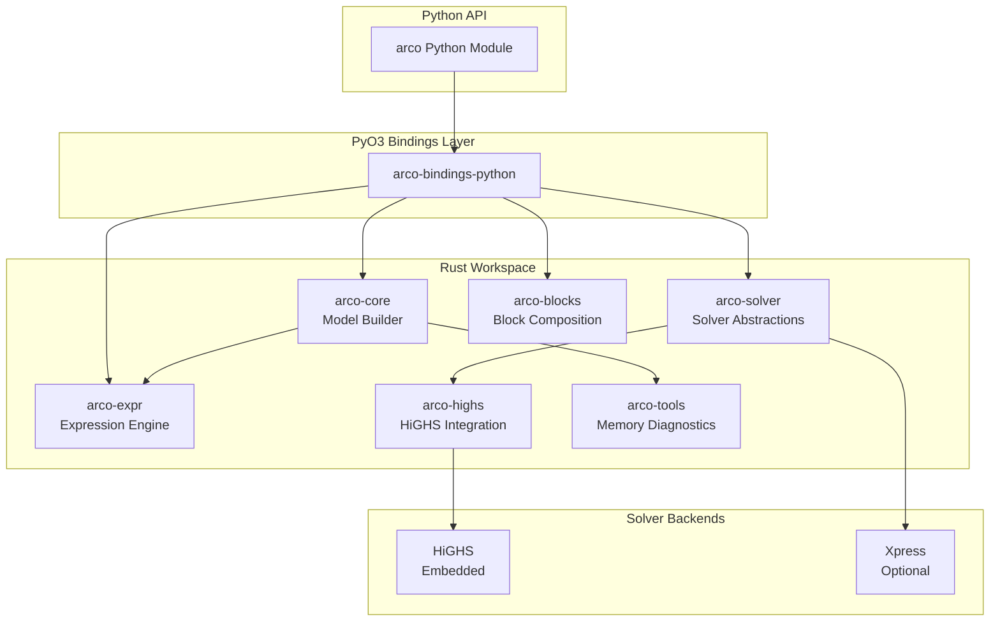

<div align="center">

# Arco

**A memory-smart optimization library for LP and MIP problems on constrained hardware.**

[](https://github.com/pesap/arco/actions/workflows/ci.yaml)
[](https://pypi.org/project/arco/)
[](https://www.rust-lang.org/)
[](./licenses/BSD-3-Clause.txt)
[](./docs/)
[](https://pypi.org/project/arco/)

</div>

> [!WARNING]
> Arco is built primarily for internal use within our organization. You are welcome to try it, but we make no guarantees about API stability or robustness at this stage. For battle-tested alternatives, consider [Pyomo](https://www.pyomo.org/) (Python) or [JuMP](https://jump.dev/) (Julia).

Arco (**Assembled Resource-Constrained Optimization**) is an experimental optimization framework for linear and mixed-integer programming. The primary user-facing API is the Python binding module `arco`, backed by Rust crates for model construction, solver integration, and diagnostics.

Built for harder optimization problems on constrained resources, Arco is intentional about every allocation, careful with stack and heap behavior, and relentless about minimizing memory usage so more systems can run real workloads.

## Table of Contents

- [Quickstart](#quickstart)
- [Installation](#installation)
- [Usage](#usage)
  - [Your First Model](#your-first-model)
  - [Indexed Variables](#indexed-variables)
  - [Block Composition](#block-composition)
- [Features](#features)
- [Architecture](#architecture)
- [Benchmarking](#benchmarking)
- [Contributing](#contributing)
- [License](#license)

## Quickstart

Install with `uv` (recommended) or `pip`:

```bash
uv add arco
```

```python
import arco

model = arco.Model()

x = model.add_variable(lb=0, name="x")
y = model.add_variable(lb=0, name="y")

model.add_constraint(x + y >= 5.0, name="demand")
model.minimize(3.0 * x + 2.0 * y)

solution = model.solve()
print(f"x = {solution.value(x):.2f}, y = {solution.value(y):.2f}")
print(f"objective = {solution.objective_value:.2f}")
```

Output:
```
x = 0.00, y = 5.00
objective = 10.00
```

> [!NOTE]
> Arco embeds the HiGHS solver. No external solver installation or configuration required.

## Installation

### Prerequisites

- Python 3.9 or newer
- (Optional) `uv` for fast, reproducible Python environments

### From PyPI

Using `uv`:
```bash
uv add arco
```

Using `pip`:
```bash
pip install arco
```

### From Source

For development or to build the Rust extension locally:

```bash
git clone https://github.com/pesap/arco.git
cd arco

# Install just (command runner)
cargo install just

# Build and install Python extension in development mode
just py-dev

# Run tests
just test
uv run pytest
```

## Usage

### Your First Model

Build and solve a production planning problem:

```python
import arco

# Create a model
model = arco.Model()

# Decision variables: production quantities
x = model.add_variable(
    bounds=arco.Bounds(lower=1.0, upper=float("inf")),
    name="product_x"
)
y = model.add_variable(
    bounds=arco.Bounds(lower=2.0, upper=float("inf")),
    name="product_y"
)

# Constraint: total production must meet demand
model.add_constraint(x + y >= 5.0, name="demand")

# Objective: minimize production cost
model.minimize(3.0 * x + 2.0 * y)

# Solve and inspect results
solution = model.solve()
assert solution.is_optimal()

print(f"Optimal: x={solution.value(x):.1f}, y={solution.value(y):.1f}")
print(f"Cost: {solution.objective_value:.1f}")
```

### Indexed Variables

Work with structured, array-like variables for large-scale problems:

```python
import arco

model = arco.Model()

# Create index sets
plants = model.add_index_set(["NYC", "LA", "CHI"])
products = model.add_index_set(range(5))

# Create a 2D array of variables
production = model.add_variables(
    index_sets=[plants, products],
    bounds=arco.Bounds(lower=0, upper=100),
    name="production"
)

# Use operators on arrays
total_by_plant = production.sum(axis=1)
model.add_constraint(total_by_plant >= 10)

solution = model.solve()
```

### Block Composition

Compose multi-stage optimization workflows using blocks:

```python
from dataclasses import dataclass
import arco
from arco import block

@dataclass
class FacilityInput:
    capacity: float
    demand: float

@block
def facility_block(model, data: FacilityInput):
    x = model.add_variable(lb=0, ub=data.capacity, name="output")
    model.add_constraint(x >= data.demand)
    model.minimize(x)
    return {"output": x}

# Build model with blocks
model = arco.Model()
block_handle = model.add_block(facility_block, FacilityInput(capacity=100, demand=50))
solution = model.solve()
```

> [!TIP]
> See the [tutorials](./docs/tutorials/) and [how-to guides](./docs/how-to/) for comprehensive examples.

## Features

| Feature | Status | Description |
|:--------|:------:|:------------|
| **Model Construction** | ✅ | Zero-copy data structures with intuitive Python operator overloading |
| **LP / MIP Solving** | ✅ | Linear and mixed-integer programming via embedded HiGHS |
| **HiGHS Backend** | ✅ | Open-source solver embedded out of the box |
| **Xpress Backend** | ✅ | Commercial solver support for enterprise users |
| **Block Orchestration** | ✅ | DAG-based composition for multi-stage problems |
| **Memory Diagnostics** | ✅ | Built-in tracking of memory usage and bottlenecks |
| **Warm Starting** | ✅ | Reuse solutions across sequential solves |
| **NumPy Integration** | ✅ | Array arithmetic, element-wise operations, reductions |
| **Parallel Block Solve** | 🚧 | Under testing for concurrent block execution |
| **Distributed Execution** | 📋 | Planned for distributed optimization workflows |

**Legend:** ✅ Available | 🚧 Under Testing | 📋 Planned

## Architecture

Arco is organized as a Rust workspace with Python bindings:



### Crate Overview

| Crate | Purpose |
|:------|:--------|
| `arco-core` | Model construction, variables, constraints, objectives |
| `arco-expr` | Expression trees and constraint generation |
| `arco-solver` | Solver-agnostic abstractions and solution handling |
| `arco-highs` | HiGHS solver integration (embedded) |
| `arco-blocks` | DAG-based block composition and orchestration |
| `arco-tools` | Memory instrumentation and diagnostics |
| `arco-bench` | Benchmarking framework for regression testing |

## Benchmarking

Use `arco-bench` to run performance benchmarks and catch regressions:

```bash
# Run default benchmark scenarios
just bench-run

# Run with custom parameters
just bench-run --scenario model-build,fac25 --cases 1000,10000 --repetitions 3

# Generate report
just bench-report artifacts/bench/results.jsonl

# Compare and gate on regressions
just bench-gate baseline.jsonl candidate.jsonl 5 5
```

## Contributing

Contributions are welcome. Please see [`CONTRIBUTING.md`](./CONTRIBUTING.md) for the development workflow, testing expectations, and documentation requirements.

Quick start for contributors:

```bash
# Setup
just fmt      # Format code
just clippy   # Run linter
just check    # Type-check workspace

# Testing
just test     # Run Rust tests
just py-test  # Run Python doctests

# Full CI gate
just ci
```

Release and versioning behavior is defined in [`RELEASE_POLICY.md`](./RELEASE_POLICY.md).

## License

Arco is licensed under the BSD 3-Clause License. See [`licenses/BSD-3-Clause.txt`](./licenses/BSD-3-Clause.txt) for details.

The embedded HiGHS solver is licensed under the MIT License. See [`licenses/HiGHS-MIT.txt`](./licenses/HiGHS-MIT.txt) for details.

---

<div align="center">

**[Documentation](./docs/)** · **[Issues](https://github.com/pesap/arco/issues)** · **[Releases](https://github.com/pesap/arco/releases)**

</div>
