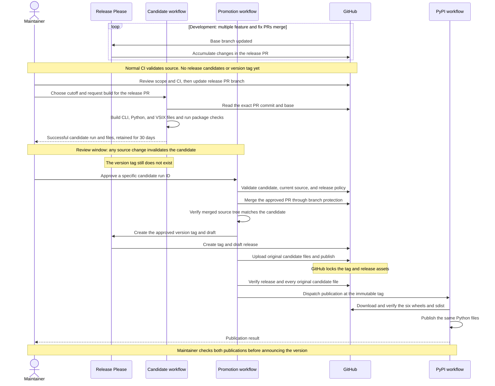
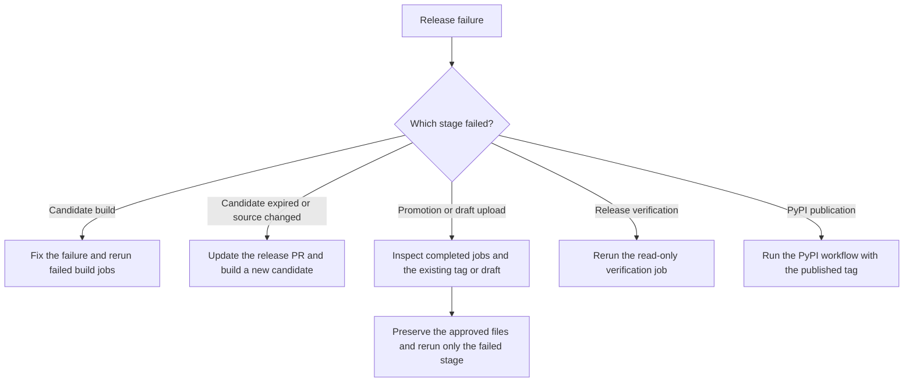

# Release Policy

Arco uses one version across the Rust workspace, Python package, release tag, and
GitHub Release. Release Please updates the versions and changelog together.
Maintainers choose the release cutoff and approve the candidate files before
Release Please creates the version tag.

## Maintainer responsibilities

Several feature and fix PRs can merge before a release. Release Please accumulates
those changes in its release PR. Merging an ordinary PR does not build release
candidates or create a version tag.

At cutoff, maintainers:

1. Review the proposed version, changelog, compatibility changes, and required CI.
2. Update the release PR branch from its base if it is behind. Release Please can
   leave the branch unchanged when new commits do not affect its release notes.
3. Run Build release candidate on the base branch with the release PR number.
4. Review the successful run and its candidate artifacts within their 30-day
   retention window. Coordinate merges to keep the cutoff unchanged.
5. Run Promote release candidate on the same base branch with that candidate run
   ID. This is approval to merge the release PR, create its version tag, and publish
   those files. Do not merge the release PR directly.
6. Verify GitHub publication and the separate Python publication run before
   announcing the new version. Approve the `pypi` deployment if that environment
   has required reviewers configured.

A changed release PR or base invalidates the candidate. Build a new candidate
before approving the revised scope. Once the version is published, ship source
fixes as a new version; never replace its files or move its tag.

## Ownership and flow

Release Please manages release metadata. Its normal workflow only opens or updates
release PRs. Candidate builds run on explicit request and use the release PR's
source commit. Cargo-dist plans and builds the CLI distributions; the shared
package workflow builds Python distributions and the VS Code extension.

Passing normal PR CI validates the proposed source. Passing the candidate workflow
produces the complete files available for release approval. Neither creates the
version tag. Promotion downloads the approved run's artifact bundle and checks
that the release PR and its base are unchanged before merging.

GitHub's normal merge can create a different commit SHA. Promotion checks that the
merged commit has the same Git source tree as the candidate before calling Release
Please. It then publishes the saved files without rebuilding. The read-only
verification job checks the release attestation and every original candidate file.

Python publication runs separately because PyPI trusted publishing does not
support reusable workflows. It downloads and verifies the Python files from the
immutable GitHub Release. A successful dispatch does not mean PyPI has finished.

## Published artifacts

The candidate bundle contains the following files. GitHub Release hosts the
complete bundle; PyPI receives only the Python distributions.

| Artifact                   | Platforms or contents                                                                   | Destination             |
| -------------------------- | --------------------------------------------------------------------------------------- | ----------------------- |
| CLI archives               | Linux and macOS on x86_64 and arm64; Windows on x86_64                                  | GitHub Release          |
| CLI installers             | Shell and PowerShell scripts                                                            | GitHub Release          |
| Release metadata           | Source archive, Cargo-dist manifest, generated checksums, and candidate source identity | GitHub Release          |
| Six Python wheels          | `cp310-cp310` and `cp311-abi3` for Linux x86_64, macOS arm64, and Windows x86_64        | GitHub Release and PyPI |
| Python source distribution | One sdist for the release version                                                       | GitHub Release and PyPI |
| VS Code extension          | One `.vsix` package                                                                     | GitHub Release          |

The pipeline does not publish the VSIX to the VS Code Marketplace. Linux Python
wheels use the pinned manylinux 2.28 baseline. Each release wheel is installed and
imported before it becomes part of the candidate.

## Recovery

Use GitHub's Re-run failed jobs to retain successful jobs and their outputs. Do not
use a full workflow rerun to rebuild an approved or published version. If candidate
artifacts expire before approval, build and review a new candidate.

If a draft upload fails after adding some files, confirm the release is still a
draft, remove the partial draft assets through GitHub's release editor, then rerun
the failed upload job using the original candidate. Inspect completed merge and
Release Please jobs before retrying; do not repeat those mutations manually.

Verification and PyPI failures do not require another merge, tag, or build.
Rerun failed verification jobs, or run `publish-pypi.yml` at the published tag with
that tag as its input. PyPI retries use `skip-existing: true` and the original
GitHub files. Check the Python publication result separately.

If source changes are needed after tagging, issue a new version. Published tags
and files are never replaced.

## Repository setup

Before production release:

- Enable GitHub Immutable Releases and protect `v*` tags against updates and
  deletion. Promotion checks immutability before merging or creating a tag.
- Configure `RELEASE_PLEASE_TOKEN` for the immutability-settings check with
  repository Contents read and Administration read access. Release Please and
  promotion use `GITHUB_TOKEN` for PR, merge, tag, and release operations.
- Allow GitHub Actions to create pull requests. Require normal CI and Cargo-dist
  configuration checks through branch protection. Use the promotion procedure
  for release PRs; a direct merge leaves an unapproved release that blocks tagging.
- Register `publish-pypi.yml` and environment `pypi` as the PyPI trusted publisher.
- Keep `attestations: read` on jobs that verify GitHub release attestations.
- Run the full candidate matrix before the first production release. The
  [sandbox evidence](https://github.com/pesap/actions-test#live-sandbox-evidence)
  establishes the cutoff, source-tree check, and artifact promotion with a small
  Linux CLI; it does not replace Arco's solver and package validation.

Release Please runs on `main` and supported `release/*` branches. Run candidate and
promotion workflows from the intended base branch. Backport release-tooling fixes
when maintaining a release branch.
