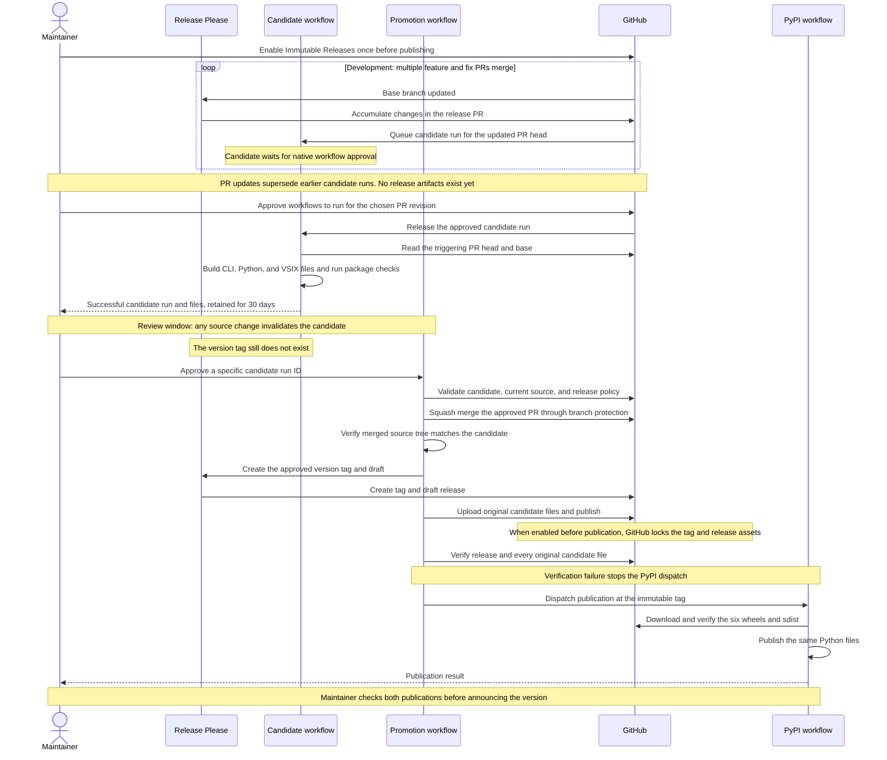
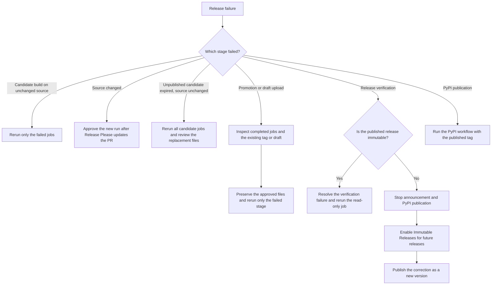

# Release Policy

Arco uses one version across the Rust workspace, Python package, release tag, and
GitHub Release. Release Please updates the versions and changelog together.
Maintainers choose the release cutoff by approving the candidate workflow for an
exact release PR revision before Release Please creates the version tag.

## Maintainer responsibilities

Several feature and fix PRs can merge before a release. Release Please accumulates
those changes in its release PR. The candidate workflow is queued on the release
PR but does not build release artifacts until a maintainer approves it in the PR
merge box.

At cutoff, maintainers:

1. Confirm that an organization or repository administrator has enabled GitHub
   Immutable Releases. This one-time setting must be enabled before publication.
2. Review the proposed version, changelog, compatibility changes, and required CI.
3. Let Release Please finish updating the release PR from its current base.
4. In the release PR merge box, select Approve workflows to run for the exact PR
   revision that defines the cutoff. The candidate workflow selects the PR's base
   branch and builds the triggering head commit.
5. Review the successful run and its candidate artifacts within their 30-day
   retention window. Coordinate merges to keep the cutoff unchanged.
6. Manually run Promote release candidate on the same base branch with that
   candidate run ID. This is approval to squash merge the release PR, create its
   version tag, and publish those files. Do not merge the release PR directly.
7. Verify GitHub publication and the separate Python publication run before
   announcing the new version. Approve the `pypi` deployment if that environment
   has required reviewers configured.

A release PR update supersedes any earlier candidate. Approve the new pending run
for the updated head before promotion. Promotion's source checks reject a stale
run ID. Once the version is published, ship source fixes as a new version; never
replace its files or move its tag.

## Ownership and flow

Release Please manages release metadata. Its normal workflow opens or updates
release PRs with the workflow-provided `GITHUB_TOKEN`. This design assumes those
automated updates receive GitHub's native Approve workflows to run gate. A human
push does not receive the same gate and is not a release cutoff mechanism. See
[GitHub's `GITHUB_TOKEN` workflow-run behavior](https://docs.github.com/en/actions/concepts/security/github_token#when-github_token-triggers-workflow-runs).

Native approval releases the workflows pending for that PR revision. The candidate
is not a separate approval stage after normal PR CI. Before approval it produces no
release artifacts. Once approved, it uses the triggering PR head and automatically
selects that PR's `main` or `release/*` base. Cargo-dist plans and builds the CLI
distributions; the shared package workflow builds Python distributions and the VS
Code extension.

Passing the candidate workflow produces the complete files available for release
approval but does not create the version tag. Promotion downloads the approved
run's artifact bundle and checks that the release PR and its base are unchanged
before merging.

Promotion squash merges the release PR through GitHub. The squash commit has a
different SHA from the candidate, so promotion checks that both commits have the
same Git source tree before calling Release Please. It then publishes the saved
files without rebuilding. The read-only
verification job checks the release attestation and every original candidate file.
These checks run after GitHub publication and gate the PyPI dispatch. They detect
an immutable-release configuration failure but cannot make an existing mutable
release immutable.

Python publication runs separately because PyPI trusted publishing does not
support reusable workflows. It downloads and verifies the Python files from the
immutable GitHub Release. A successful dispatch does not mean PyPI has finished.

## Published artifacts

The candidate bundle contains the following files. GitHub Release hosts the
complete bundle; PyPI receives only the Python distributions.

| Artifact                   | Platforms or contents                                                                   | Destination             |
| -------------------------- | --------------------------------------------------------------------------------------- | ----------------------- |
| CLI archives               | Linux and macOS on x86_64 and arm64; Windows on x86_64                                  | GitHub Release          |
| CLI installers             | Shell and PowerShell scripts                                                            | GitHub Release          |
| Release metadata           | Source archive, Cargo-dist manifest, generated checksums, and candidate source identity | GitHub Release          |
| Six Python wheels          | `cp310-cp310` and `cp311-abi3` for Linux x86_64, macOS arm64, and Windows x86_64        | GitHub Release and PyPI |
| Python source distribution | One sdist for the release version                                                       | GitHub Release and PyPI |
| VS Code extension          | One `.vsix` package                                                                     | GitHub Release          |

The pipeline does not publish the VSIX to the VS Code Marketplace. Linux Python
wheels use the pinned manylinux 2.28 baseline. Each release wheel is installed and
imported before it becomes part of the candidate.

## Recovery

Use GitHub's Re-run failed jobs to retain successful jobs and their outputs while
the triggering source is unchanged. If the release PR head or base changes, wait
for Release Please to update the PR and approve the new pending run. Approving an
old run does not refresh its source.

If an unpublished candidate's artifacts expire while its source is unchanged, a
maintainer can use Re-run all jobs to build replacement files. Review that complete
candidate again before promotion. Never rebuild a published version.

If a draft upload fails after adding some files, confirm the release is still a
draft, remove the partial draft assets through GitHub's release editor, then rerun
the failed upload job using the original candidate. Inspect completed merge and
Release Please jobs before retrying; do not repeat those mutations manually.

For an immutable published release, resolve transient verification failures and
rerun the read-only verification job. PyPI failures can be retried by running
`publish-pypi.yml` at the published tag with that tag as its input. PyPI retries
use `skip-existing: true` and the original GitHub files.

If verification finds that the published release is mutable, stop the announcement
and do not dispatch PyPI publication. Enabling Immutable Releases protects only
new releases; it does not change the existing release. Enable the setting, preserve
the published tag and files, and issue a new version.

If source changes are needed after tagging, issue a new version. Published tags
and files are never replaced.

## Repository setup

Before production release:

- Have an organization or repository administrator enable GitHub Immutable
  Releases once before publishing. The setting applies to new releases, so it
  cannot repair a release that was already published while the setting was off.
- Protect `v*` tags against updates and deletion. Release Please and promotion use
  the workflow-provided `GITHUB_TOKEN`; no additional personal access token is
  required for release operations.
- Enable squash merging in Settings → General → Pull Requests. Promotion uses
  this method to merge the approved release PR.
- Allow GitHub Actions to create pull requests. Require normal CI and Cargo-dist
  configuration checks through branch protection. Use the promotion procedure
  for release PRs; a direct merge leaves an unapproved release that blocks tagging.
- Register `publish-pypi.yml` and environment `pypi` as the PyPI trusted publisher.
- Keep `attestations: read` on jobs that verify GitHub release attestations.
- Run the full candidate matrix before the first production release. The
  [sandbox evidence](https://github.com/pesap/actions-test#live-sandbox-evidence)
  establishes the cutoff, source-tree check, and artifact promotion with a small
  Linux CLI; it does not replace Arco's solver and package validation.

Release Please runs on `main` and supported `release/*` branches. Candidate runs
select the release PR's base automatically. Run only promotion manually from that
same base branch, using the approved candidate run ID. Backport release-tooling
fixes when maintaining a release branch.
