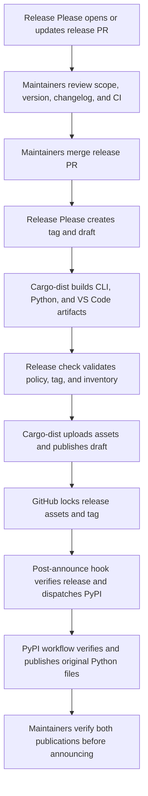
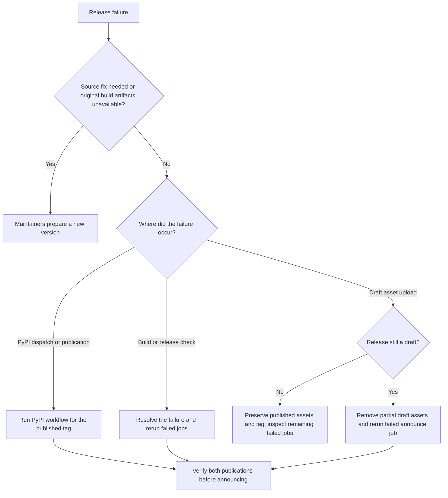

# Release Policy

Arco uses one version across the Rust workspace, Python package, release tag, and
GitHub Release. Release Please updates the versions and changelog together.

## Maintainer responsibilities

Maintainers decide when a version is ready to ship. **Merging the Release Please
PR authorizes automatic publication**: the draft is a staging step, with no
separate manual approval before Cargo-dist publishes it.

- **Before merging:** review the version, changelog, compatibility changes, and
  release scope; confirm required CI and Cargo-dist configuration checks pass.
  Confirm the [repository setup](#repository-setup) is complete, coordinating
  with repository administrators for settings and credentials.
- **During publication:** monitor the tag's Cargo-dist run and the separate
  Publish Python distributions run. If the `pypi` environment has required
  reviewers configured, approve that deployment after reviewing the release.
- **Before announcing availability:** confirm the GitHub Release is published
  and immutable, its expected assets are present, and the matching version is
  available on PyPI. A successful dispatch alone does not mean PyPI succeeded.
- **On failure:** inspect the failed job and follow [recovery](#recovery).
  Preserve published tags and files; ship source fixes as a new version.
- **For supported release branches:** backport necessary release-tooling fixes
  and apply the same review, verification, and recovery responsibilities.

## Ownership and flow

1. **Release Please** opens the release PR. After merge, it creates a draft
   release and a real `vX.Y.Z` tag using `draft: true` and
   `force-tag-creation: true`.
2. **Cargo-dist** runs its generated `v-release.yml` on the tag push. It builds
   CLI archives and installers. The `local-artifacts-jobs` hook builds and
   smoke-tests six Python wheels, builds the sdist, and packages the VSIX.
3. **The release check** runs through Cargo-dist's `publish-jobs` hook. It checks
   repository immutability, the draft and tag, and the complete local inventory.
4. **Cargo-dist publishes** using `create-release = false`: it uploads all
   `artifacts-*` outputs to the existing draft and undrafts it after upload
   succeeds. GitHub then locks the release assets and tag.
5. **The post-announce hook** verifies the immutable release and dispatches
   `publish-pypi.yml` at that tag. PyPI downloads the seven Python distributions,
   verifies their GitHub release attestations with `gh release verify-asset`,
   and publishes through trusted publishing.

Edit `dist-workspace.toml` and `.github/build-setup.yml`, then run `dist generate`.
Do not edit the generated workflow. Cargo-dist owns its matrix, artifact handoff,
manifest, upload, and publication ordering. GitHub Actions Quality runs
`dist generate --check` and `dist plan` to catch drift.

The separate PyPI workflow is required because PyPI trusted publishing does not
support reusable workflows. The post-announce hook only dispatches it; a successful
Cargo-dist run means publication was requested, not that PyPI has finished.

## Validation

Normal CI checks the source and CLI solvers. Packaging changes also run Python
3.10–3.14 wheel smoke checks. Release builds use the tag's commit, and each release
wheel is installed and imported before upload. Python releases contain two ABIs
(`cp310-cp310`, `cp311-abi3`) on Linux x86_64, macOS arm64, and Windows, plus one
sdist. The Linux baseline is the pinned manylinux 2.28 image.

Run `just release-check` with Cargo-dist 0.31.0 installed to check generated CI
and planning locally. The PyPI workflow currently accepts stable `vX.Y.Z` tags.

## Recovery

Maintainers choose the recovery path from the failed job and the release's
current state:

Use GitHub's **Re-run failed jobs** on the original tag workflow. Successful build
jobs and their Actions artifacts are retained, so a publication retry uses the
original files. Do not use a full rerun to rebuild an already published version.

Cargo-dist's existing-draft uploader does not resume partial uploads. If the final
upload fails after adding some assets, confirm the release is still a draft,
remove those partial draft assets through GitHub's release editor, then rerun the
failed announce job. Never remove the tag or assets of a published release.
This is an operator recovery step, not an automatic reconciliation service.

If the post-announce dispatch or PyPI publication fails, run `publish-pypi.yml`
with the published tag. It verifies and republishes the original GitHub assets
with `skip-existing: true`; it never rebuilds packages. Check that workflow's
result separately from the Cargo-dist run.

If source changes are needed, or the original build artifacts are no longer
available, issue a new version. Published release files are never replaced.

## Repository setup

Before production release:

- Enable GitHub Immutable Releases and protect `v*` tags against updates and
  deletion. The release check refuses publication when immutability is disabled.
- Configure `RELEASE_PLEASE_TOKEN` with contents and pull-request write access,
  plus Administration read access for GitHub's immutability-settings API. The
  PAT/App token is also needed so Release Please's tag push triggers Actions;
  a tag created with the default `GITHUB_TOKEN` does not trigger this workflow.
- Register `publish-pypi.yml` and environment `pypi` as the PyPI trusted publisher.
- Require normal CI and Cargo-dist configuration checks before merging release
  PRs. Validate draft publication, partial-upload recovery, immutable locking,
  and PyPI retry in a sandbox before enabling production releases.

Release Please runs on `main` and supported `release/*` branches. Backport changes
to the release tooling when maintaining a release branch.
